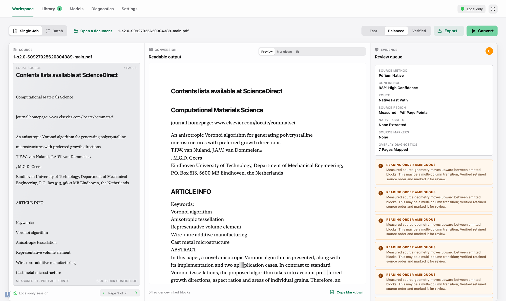
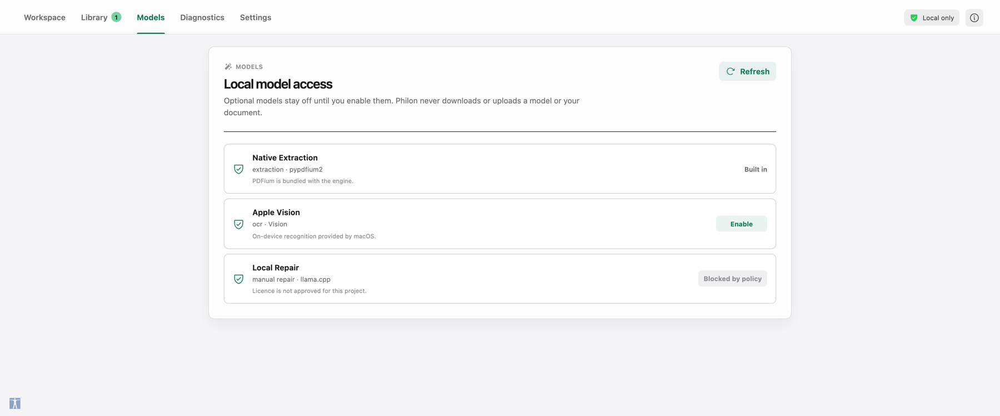
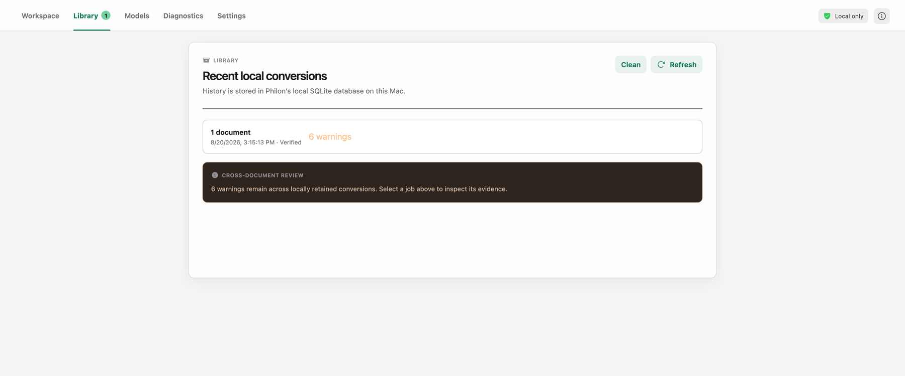
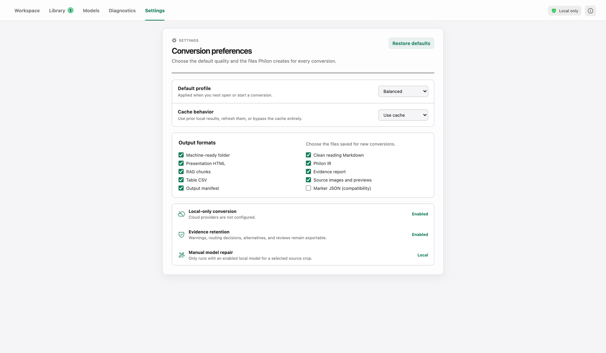

<div align="center">


# Philon

**Documents converted with their evidence intact.**

A macOS-first, local-first document conversion workspace. Philon begins with a
document's own structure, keeps the evidence for every block it emits, and
marks uncertainty instead of quietly inventing text.

</div>

---

## Why it is called that

Philon of Alexandria spent his life reading one tradition in the language of
another. Writing in Greek in the first century, he worked through the Hebrew
scriptures a passage at a time — quoting the line, then drawing out what he
took it to mean — and he held that the literal sense had to stand even where
the allegory moved him most, against contemporaries content to let the reading
replace the text.

A conversion is a reading. A PDF becomes Markdown only because something
decided what was a heading, what was a table, and what the letters were. Philon
keeps the source beside the reading, and marks what it cannot settle instead of
smoothing it into fluent text nobody can go back and verify.

## The workspace



Three panels, always together. The **source** as Philon read it, the
**conversion** it produced, and the **evidence** behind the selected block —
which method read it, how confident that reading is, whether the source region
was measured, whether the page it sits on is rotated, what the source declared
by way of links, and what the Verified checks found. Selecting a block in either
of the first two panels moves the other two with it.

The warnings on the right are not decoration. `READING ORDER AMBIGUOUS` means
the measured geometry moved upward between emitted blocks: possibly a
multi-column transition. Philon keeps the source order, says so, and asks for
review rather than guessing.

## What it does

- **Evidence for every block.** A versioned Philon IR carries source method,
  confidence, validation record, warnings, measured source geometry, the page's
  own rotation, the links its source declared, the tables recovered from the
  rules it draws, and stable block IDs. Geometry is
  measured in the frame the page is *displayed* in: PDFium reports page size
  with `/Rotate` applied and text rectangles without it, and recording the two
  as though they shared a frame put a rectangle outside the page it belonged to.
- **Native structure first.** PDFium-first extraction, with Apple Vision for
  on-device recognition of images and textless pages. A page that cannot be read
  is reported, never invented.
- **Three profiles.** `Fast` is native-text only and never invokes OCR.
  `Balanced` is the default, using Apple Vision only for image or textless-PDF
  input. `Verified` adds deterministic source-geometry, duplicate-content, and
  reading-order ambiguity checks; it reports uncertainty for review rather than
  changing source order.
- **A page range when you want one.** A Single Job converts `1-5,8` instead of
  the whole document. The selection is part of the cache key and of the export
  directory name, so a conversion of ten pages is never served for, or written
  over, the conversion of the whole book.
- **The links a PDF declared.** A link annotation carries a target and a
  rectangle. Which characters that rectangle covers is measured, one character
  box at a time, so a rectangle over no text is reported with no anchor rather
  than attached to whatever was nearest. Only `http`, `https` and `mailto`
  become clickable: a PDF may declare any URI, `javascript:` included, and the
  presentation export is a document someone opens locally. The rest stay
  recorded as evidence, where they can be seen.
- **Running heads, even when they carry a folio.** A head printed as
  "Symmetries of Culture 47" is a different string on every page it appears on.
  The number is set aside before counting, so the head is recognised as an
  artifact instead of being emitted as body text on every page of a book.
- **Intake preflight.** Invalid signatures, empty files, password-protected
  PDFs, and documents beyond the V1 size and page limits are refused before
  extraction. A PDF that is encrypted with an *empty* user password is opened,
  because it opens for everyone else too, and the record says that is what
  happened.
  Images are checked for container integrity, single-frame status, and a
  100-megapixel ceiling before anything reaches OCR.
- **Local review as provenance.** Accepting, editing, or restoring a candidate
  is recorded as a reversible decision, and the original candidate is retained.
- **Single Job and Batch.** Batch items pause and cancel at a document boundary,
  and an interrupted batch is still there after a restart.

### Local model access



Optional model packs stay off until you enable them, and a pack whose licence
has not been approved cannot be enabled at all — the control is disabled and
says why. The pane reports readiness, missing runtimes, and policy blocks
**without loading a model or making a network request**.

### History and preferences

 

Conversion history is a local SQLite database on your Mac. Removing it removes
the records, not the files you exported. Output formats are chosen once and
apply to every new conversion.

## Local only

The desktop host launches `engine/philon_engine.py` as a local process and
talks to it over a `0600` Unix-domain socket authenticated with a per-session
token. There is no local HTTP server and no cloud credential. `npm run
local-only:check` is a source-level gate that fails the build if an HTTP client
reaches the runtime sources, so this stays true rather than merely being
intended.

**Your documents are yours. Philon never sends a document, a fragment, or a
filename anywhere, and conversion opens no connection at all.** That is the
guarantee, and it is unchanged.

There is exactly **one** thing Philon will fetch, and only when you ask for it
by name: a model pack you choose in the Models pane. It is worth stating
precisely what that does and does not mean.

- The fetch lives in `engine/model_fetch.py`, the single file exempt from the
  local-only gate. The exemption is a **named file**, not a relaxed pattern, so
  every source that runs a conversion is still held to the original rule.
- The gate checks the exemption is load-bearing — a file listed there with no
  network call in it fails the build rather than quietly widening the rule —
  and separately checks that the conversion engine never imports the fetcher at
  module scope. A conversion cannot reach the network even by accident.
- `npm run model-fetch:check` holds that one file to HTTPS, an **exact-match**
  host allow-list (a suffix test would accept `huggingface.co.example.invalid`),
  a re-check of every redirect hop, and a SHA-256 comparison that must pass
  *before* anything is moved into place. It also refuses a pack the model
  policy has not approved, so a download is not a way around the licence gate.
- The one host rule that is not exact match is the CDN HuggingFace redirects
  large files to, which is named for the region a client resolves to and cannot
  be listed exhaustively. A host beneath a named parent is allowed, matched as
  the bare parent or with a **leading dot** in front of it — so
  `us.aws.cdn.hf.co` passes and `cdn.hf.co.example.invalid` does not. The gate
  fails if that dot goes missing.
- The redirect re-check has to be *reachable*, which is a separate property from
  existing. It was not, until a real download found it: `urllib.request.urlopen`
  follows redirects itself and returns only the final response, so the
  hand-written check covered the first URL and nothing after it, and a request
  to `huggingface.co` came back 200 from a CDN host the allow-list refuses. The
  fetcher now opens through an opener built to refuse redirects, and the gate
  fails if it reaches for `urlopen` or drops that handler.
- It uses only the standard library, so the dependency count and the SBOM are
  unchanged.
- Every digest in the manifest was computed from a real copy of the file, so a
  download is checked against known-good bytes rather than against whatever a
  host serves.

A model you already have is never downloaded: Philon discovers copies across
the usual local stores first, and only offers to fetch what is genuinely
absent. Nothing about your documents is ever sent, including to fetch a model —
the request carries a pack name and nothing else.

## Deliberate V1 boundaries

The architecture includes adapters for tables, formulas, layout models, and manual local VLM repair. Those model packs are intentionally not bundled yet: each needs a documented accuracy bakeoff and licence approval before it becomes a Philon runtime dependency. Apple Vision is an approved macOS-system OCR runtime; its output retains line confidence and provenance.

On first launch Philon opens the Models pane, reports which approved packs are
already on the machine, and offers to download the ones that are not. It records
that it did so, and an ordinary launch goes straight to the workspace.

The Models pane can also discover local olmOCR, Qwen, and BGE-M3 copies from
the system model inventory. On this private development Mac, Qwen 3.8 27B with
its local multimodal projector is the preferred repair adapter; olmOCR is
retained as the fallback. Philon renders and retains the selected source crop
and records the candidate and model artefact fingerprint.

Repair is manual unless a run explicitly asks otherwise. Text is replaced only
when `local_repair` is set, only where the health gate already refused to vouch
for the text, and the extracted words are retained beside every replacement so
they can be restored — see the automatic-repair note under Releases.

The **3B** copy of Qwen 2.5 VL installed here is blocked: its `LICENSE` is the
Qwen Research License, which is non-commercial. This is specific to that
checkpoint, not to the model family — the 7B and 32B builds are Apache-2.0 and
would be approvable. BGE-M3 is permitted only as a user-authorized local
Verified sidecar; its runtime and artifact are checked before vector export.

The Models pane reports readiness, missing runtimes and policy blocks without
loading a model and without making a network request. The one exception is a
download you ask for by name, described under Local only.

Philon does not reuse Marker code or models. That is a clean-room position and
a dependency budget, not a licence one: Marker relicensed GPL-3.0 → OpenRAIL →
**Apache-2.0** on 2026-07-17 and released 2.0.0 on 2026-07-20, so reuse with
attribution would now be permitted. Philon still declines it, because the whole
of Philon's conversion path runs on four runtime dependencies — PDFium, pypdf,
Pillow and, in the port, Qt — against Marker's ML stack, and because an engine
that must justify every rectangle it emits is easier to hold to that standard
when nothing in it was inherited. The compatibility export is named `page_tree`
(formerly `marker_json`) and keeps that name for the same reason: it describes
what it contains rather than what it once imitated.

The current engine also marks repeated page artifacts, retains a per-page routing decision, recovers ruled tables from the rules a page draws — including the merged cells its *missing* rules prove — recognises formulas from the script geometry a page measurably set, exports safely delimited native tables, and records local human review decisions as reversible provenance.

Automatic local VLM repair exists and is **off unless a run asks for it** (`local_repair`). When asked, it acts only on regions Philon's own health gate already refused to vouch for, uses only an approved local pack, retains the extracted text beside every replacement so it can be restored, and refuses to apply a candidate that fails the deterministic format checks. Formula *recognition* is geometric: Philon reads the superscripts and subscripts a page set, and does not attempt to parse an equation's semantics.

`Fast` is native-text only and never invokes OCR. `Balanced` is the default,
using Apple Vision only for image or textless-PDF input. `Verified` adds
deterministic source-geometry, duplicate-content, and reading-order ambiguity
checks; it reports uncertainty for review rather than changing source order.

## Development

```bash
npm install
python3 -m venv .venv
.venv/bin/pip install -r engine/requirements.txt
npm run tauri dev
```

To work on the interface without building the desktop shell, `npm run dev`
serves the workspace with a development host installed only under
`import.meta.env.DEV`, which never reaches a packaged build. It answers with a
real conversion you record yourself:

```bash
.venv/bin/python scripts/make-dev-fixture.py path/to/document.pdf
```

That fixture is untracked, because it is the full extracted text of whatever
document it was made from. Without one the workspace simply opens empty; the
dev host does not invent a document to fill it.

The screenshots above are produced by `node scripts/make-screenshots.mjs`
against that dev server, so they can be regenerated rather than hand-collected.
The document shown in them is a journal article converted locally; only the
images are committed, not its text.

## Verification

`npm test` runs the workspace, engine, and type checks together. `npm run
release:verify` runs the complete sequence below, which is what CI performs.

```bash
npm run license:check      # model packs carry an approved licence
npm run sbom:check         # every declared dependency is in SBOM.cdx.json
npm run local-only:check   # no HTTP client reached the runtime sources
npm run model-fetch:check  # the one exempt file is held to its own policy
npm run parity:check       # the port's engine still differs by one documented hunk
npm run test:ui            # workspace logic and React component behaviour
npm run test:engine        # engine, socket bridge, preflight fuzz, benchmark harness
npm run test:bench         # benchmark harness alone, also covered by test:engine
npm run build              # tsc --noEmit and the production bundle
cargo test  --manifest-path src-tauri/Cargo.toml
cargo check --manifest-path src-tauri/Cargo.toml
```

`parity:check` is the one that needs something outside this repository. Philon's
engine exists twice — here, and in the PySide6 port — and each copy is only ever
tested by its own suite, so the two can drift apart with every test passing.
They once drifted to forty-six hunks that way. `tests/parity_policy.py` compares
them: three files byte-identical, `philon_engine.py` differing by exactly the one
hunk the port documents. With the peer checkout absent it says so on stderr and
passes, since one repository alone is a legitimate way to work; CI sets
`PHILON_PARITY_REQUIRE=1` so that going unchecked is an error there.

The same gate is available as a pre-commit hook, which is the difference between
a check that runs when someone remembers and one that runs every time:

```bash
zsh scripts/install-git-hooks.sh              # opt in
zsh scripts/install-git-hooks.sh --uninstall  # opt back out
```

It sets `core.hooksPath` to the tracked `scripts/git-hooks`, refuses a commit
that would leave the two copies out of parity, and is silent otherwise. It reads
the working tree rather than the index — the gate compares against the other
repository's checkout, which has no index, so there is nothing else it could
sensibly read. `git commit --no-verify` skips it.

Tests live beside what they cover: `engine/test_engine.py` for conversion and
evidence, `engine/test_socket.py` for the authenticated Unix-socket bridge,
`engine/test_fuzz.py` for the malformed-input corpus, `bench/test_run.py` for
the benchmark harness, `src/**/*.test.ts` for workspace logic, and
`src/App.test.tsx` for the React workspace against a mocked Tauri host.

Two Apple Vision tests are skipped unless the native helper has been built and
the integration flag is set. `npm run engine:package` compiles the helper to
`engine/dist/philon-vision-ocr`; after that, run them with:

```bash
PHILON_VISION_INTEGRATION=1 npm run test:engine
```

`npm run sbom:check` cross-references `package.json` and
`src-tauri/Cargo.toml`, so adding a dependency without declaring it in
`SBOM.cdx.json` fails the check. Components record whether they are shipped,
build-only, or test-only, and a copyleft licence on a shipped component is
rejected rather than assumed to be intentional.

To rebuild and verify the ad-hoc signed DMG in the same sequence, run
`npm run release:verify -- --package`. The bundle is sealed with an ad-hoc
signature, so `codesign --verify` passes locally; it carries no Developer ID
and is not notarized.

`npm run release:verify` and the workflows run the same checks in the same
order, so a local run is not a weaker one. That equivalence is the point:
**both workflows are currently disabled**. They need `macos-15` runners, which
this private repository is billed for at ten times the wall-clock minutes, and
verification does not depend on them. Re-enable either with
`gh workflow enable "Verify Philon"`.

They are cheaper than they were if you do: `Verify Philon` now runs on branch
pushes only, so a tag no longer starts a second identical run, and it skips
pushes that touch nothing but prose. Both workflows cancel or queue per ref
rather than piling up.

`npm run release:verify -- --package` additionally produces and checksums the
DMG, which is what `Package Philon` uploads when it is enabled.

Packaging and notarization require the project owner's Apple Developer
signing credentials; no signing identity is embedded in this repository.

## Outputs

Philon 0.2 writes two complementary layers from the same local evidence:

- `machine/` is the canonical machine package. `blocks.ndjson` is streamable
  for LLMs and databases; `reading-order.json`, `pages/`, and `assets.json`
  preserve page structure, geometry, visual-asset provenance, and uncertainty.
  Each block keeps source-retained `text` beside safe-reflowed `reading_text`.
- `*.md` is clean reading Markdown for text apps. It reflows source lines and
  cautiously rejoins line-end hyphenation, but keeps source-page comments and
  never appends a distracting image gallery.
- `*.html` is a standalone responsive presentation document. It is text-first
  and places a collapsible original-page facsimile with each source page.

For each input, Philon also creates a dedicated export directory containing:

- `*.philon.json` canonical IR
- `*.chunks.json` RAG chunks with source block IDs
- `*.evidence.json` warnings, confidence summary, validation record, and timings
- `philon-output-manifest.json` stable relative file paths and SHA-256 hashes
- `assets/page-previews/*.png` local review rasters used for source/evidence overlays
- `images/*` native PDF image streams, deduplicated by hash with a page/object provenance manifest. An image whose PDF filter no browser engine can display — JPEG 2000 and TIFF, mainly — is decoded and written as PNG, because a deliverable nothing opens is not portable. The manifest keeps `source_bytes_sha256` for the bytes the PDF actually held and `source_format` for what they were, so a re-encoded export still says exactly what it came from. An image Philon could not decode at all is left as its own bytes and claims nothing.
- optional `*.page-tree.json` interchange output with embedded image data
- `tables/*.csv` for tables recovered from a page's own rules — joined across pages where the rules continue — and for native tables whose delimiter and row shape were provable

The machine package, clean Markdown, and presentation HTML are selected by
default. The page-tree JSON remains available as an explicit interchange option.
Export directories include a source-hash and profile suffix. This prevents two
unrelated `paper.pdf` files from overwriting one another, while each exported
text file is committed atomically. Markdown, semantic HTML, and the Philon IR
refer to each extracted image using a portable relative path plus source-page
provenance. Philon labels these as source assets and requests visual-description
review rather than inventing image alt text.

## Benchmarks

Use the private-corpus harness in [`bench/README.md`](bench/README.md) to record local runs, including cold/warm timing, cache use, source-map coverage, output-contract failures, and optional private-gold accuracy metrics. Every result now also records each document's filename, size and SHA-256, so a later run can prove it read the same bytes without the corpus leaving the machine.

Public claims against Marker or Docling remain **blocked** until the same version-pinned corpus, hardware, and methodology have been run. A first run against **marker-pdf 2.0.0** was recorded on 2026-08-23 — macOS 15.6 arm64, Balanced profile, two born-digital documents — and does not lift that gate: two documents on one machine is a measurement, not a claim, and it is not the corpus the heading figures above were taken on. On those two, Philon converted in 5.7s over 26 pages and 4.3s over 15 pages against Marker's 43.7s and 28.3s of wall time. Roughly 17s of each of Marker's figures is one-off model loading, which it reports itself: 24.7s and 10.3s of the wall time was conversion. Stating it both ways is the point — the wall-clock ratio is what one document costs a person, and the conversion-only ratio is what survives batching.

## Releases

A version number here describes the application. The engine contract and the IR
version are deliberately separate from it and from each other. The engine
contract remains at 0.2.0. The IR is at **0.5.0**: it gained the merged cells a
table's missing rules prove, as `spans` and `column_lines` on that record; the
formula a page's own script geometry proves, as `formula` on the block it
belongs to; and the provenance an automatic local repair leaves behind. 0.4.0
had added the tables recovered from the rules a page draws, and 0.3.0 the page's
own `/Rotate`, the source-declared links measured onto each block, and the page
selection a conversion covers. A document converted by a build carrying an IR
version has that evidence shape and says so in `philon_ir_version`.

A cache entry is named after the IR version it holds, so an entry written
against an older shape is never reached rather than being read and rejected. An
entry that cannot be read back is recomputed from the source: reuse is an
optimisation, and a broken optimisation must not be able to refuse a document.

**0.2.6** — The model fetcher's redirect check was never in force. It followed
redirects by hand and re-checked each hop against the allow-list, and
`urllib.request.urlopen` had already followed them itself and returned the final
response — so the check covered the first URL and nothing after it. Asking
`huggingface.co` for a pack file returned a 200 from a CDN host the allow-list
refuses, and nothing had looked. The first real download in the project's life
is what found it; every test had mocked the connection and exercised the
unreachable half. The fetcher now opens through an opener built to refuse
redirects, and the allow-list names the Xet CDN HuggingFace actually serves
from, matched on a leading dot so a look-alike domain cannot slip under it.

An extracted image is exported in a format something can open. JPEG 2000 and
TIFF are ordinary PDF image filters and no browser engine displays either, so a
paper whose figures were JPEG 2000 produced thirteen broken thumbnails beside
thirteen correct pixel sizes. They are decoded and written as PNG now, with the
original bytes' digest and format both recorded, so a re-encoded export still
says what it came from.

Markdown drops a column that a merged cell leaves empty in every row. HTML says
`colspan`; Markdown cannot, so those columns were printed as blanks from top to
bottom. A column covered in only some rows keeps its blanks, because dropping it
would misalign the rows that use it.

The about screen opens on every launch rather than once per version, and
`Philon ▸ About Philon` opens it too — that menu item used to open the stock
macOS panel, which carries a version number and nothing else.

The two engine copies are checked against each other by a gate rather than by
hand, on every `verify-release` and on every commit.

**0.2.5** — The Batch tab kept its documents. Adding a document emptied the
window: the queue reads each row from the record `list_batch_items` returns,
and the record arrived with every multi-word field renamed — `sourcePath`
where the workspace reads `source_path` — so the queue asked an absent path
for its file name and the render threw. Nothing typed that boundary: the
record is described in TypeScript one way and serialised the other, and the
two never meet at compile time. It is now tested on the serialised record
rather than the struct, which is the half the workspace sees.

A render failure no longer costs the whole application. There was nothing to
catch one, so a single malformed record left an empty window with no message
and no way back short of quitting. The failure is now held, reported, and
recoverable.

The Library dates its jobs again, for the same reason and with the same fix.
`new Date(…).toLocaleString()` answers the string "Invalid Date" for anything
it cannot parse — it renders, it sits where a date belongs, and it says
nothing about what Philon holds. A timestamp that will not parse is now shown
as it was stored, and an absent one is named as absent.

A warm conversion is now warm. The cache covered `make_ir`
alone, which is 17.7% of the work on a text-heavy paper and **1.1%** on an
image-heavy one, so a genuine cache hit saved 0.7% on exactly the document that
cost the most: page rasterisation and asset extraction reran every time, and
extracting 107 embedded images from a 58 MB paper takes 20.6 seconds. Both
phases now reuse their own output, which was already sitting in a
content-addressed destination beside them. Reconversion of that paper goes from
19.1 s to 0.3 s, a 63x saving; the added cold cost is 266 ms of hashing, about
1%.

Reuse is equivalent to recomputation rather than merely close to it. Each phase
writes a manifest atomically **after** it succeeds, recording the source path
and the sha256 of every file it produced, and reuse happens only when that
manifest reads back and every file still hashes to what it claims — so an
interrupted run leaves no manifest and cannot be mistaken for a finished one, a
tampered or missing file is refused, and another document's manifest is refused
even where the bytes would match. `bypass` and `refresh` still recompute
everything. A truncated asset extraction replays its `ASSET_EXTRACTION_LIMIT`
warning, because reusing the files without it would quietly turn a bounded
export into a complete-looking one.

Proving that equivalence surfaced a separate defect, which is recorded and not
fixed: one CCITT fax image in a reference paper fails to decode and produces
**different bytes on every extraction**, so its `bytes_sha256` — its provenance
— changes run to run. See `documents/CACHE_BOUNDARY_AND_ASSET_COST.md`.

**Unreleased** — Merged cells, continued tables, formulas, and an automatic
repair that must be asked for.

**A rule that stops is evidence too.** A complete lattice encloses one cell per
opening; where a rule stops, the openings either side of it were never
separated, and the page is saying they are one cell. That absence is now read
as a span. It converts the case Philon previously refused: on the reference
paper, a 14x6 arrangement that had only produced a `RULED_TABLE_INCOMPLETE`
warning is recovered as a table with 27 merged cells. HTML says `colspan` and
`rowspan` for those. Markdown can say neither, so it writes a merged cell into
one column and the opening it swallowed as nothing — and where a column is
covered in *every* row, so that it is blank from top to bottom and says nothing
at all, that column is dropped rather than printed. Those 14x6 grids are three
logical columns and Markdown renders them as three. A column covered in only
some rows is kept, blanks and all: dropping it would misalign the rows that do
use it, and filling it in would repeat a value the page wrote once. The IR, the
CSV and the page-tree export stay square, because a consumer reading them by
index is entitled to the grid the recovery found. What is still refused is a
merged region that is not a rectangle — an L of three openings around a fourth —
which no table can express and which is reported instead of being forced.

**A table continued onto the next page repeats its rules, not its headings.**
The existing test looked for a repeated header row, which a real continuation
does not have: the second page opens straight into data. Continuations are now
also recognised by matching column geometry, and which evidence applied is
recorded — because the export depends on it. A repeated header must not be
written twice; a geometric continuation must not lose its first row.

**Formulas are recognised from how the page set them.** PDFium reports each
character's true baseline and the size it is set at, and a script is smaller
than its body *and* off its baseline. Both are required, and both come from the
page rather than from glyph ink — measured from ink, the `=` in every line of
prose reads as a superscript, which is exactly what the first attempt here did.
`E = mc2` carries one formula marker as characters and two once the raised `2`
it was actually set with is written down, so the geometry is what promotes it.
A face that sets nothing but mathematics is accepted on its own. This recovers
*typesetting*, not semantics: Philon writes `x^{2}`, and does not claim to know
what the equation means.

**Automatic repair is off unless a run asks for it.** This is the one place
Philon replaces text it extracted, so the guarantees around it are the feature:
it acts only where the health gate already refused to vouch for the text, uses
only an approved and enabled local pack, retains the extracted text as a
candidate *before* replacing it so `restore_candidate` puts it back, refuses to
apply a candidate that fails the deterministic format checks, and records the
model and crop fingerprint behind every substitution. It is bounded to
`AUTOMATIC_REPAIR_MAX_BLOCKS` regions per document and reports what it left. The cache
still holds the document as the source states it — a repaired reading belongs to
the run that asked for one and is never served to a run that did not.

**Unreleased** — Tables recovered from the rules a page draws. Philon exported
only tables whose text carried a delimiter, which is the smaller half of the
problem: a ruled table has no delimiter at all. Its columns are separated by
geometry, so on a page that draws a full grid the export produced a paragraph
of run-together cells and the CSV produced nothing.

A rule is now read from PDFium's own path objects, by **bounds** rather than by
parsing segments — a rule is as often a thin filled rectangle as a stroked line,
and a segment reader sees the fill and misses the rule. Rules that cross enclose
cells; rules that merely share a page do not, so the crossings are followed as a
graph and each connected group is one candidate table. A cell's text is the
characters whose own centres land inside it, reusing the character scan already
written for link anchoring.

The alternative was pdfplumber, which was evaluated and rejected. It recovers
the same 3x3 fixture exactly, and costs `pdfminer.six`, `charset-normalizer`,
`cryptography`, `cffi` and `pycparser` — four runtime dependencies becoming
nine, ~25MB including a compiled Rust crypto library, and five new SBOM entries
per project. pypdfium2 was already a dependency and already open on the page.

Two decisions are worth stating. Rules are classified **after** the rectangle is
moved into the displayed frame, not before: on a quarter-turned page the rules
that separate rows on screen run across the page's own frame, and classifying
first arrives at every landscape table with its rows and columns transposed —
the same frame confusion that put a text rectangle outside its page.

And a lattice whose every horizontal does not meet every vertical is **reported
rather than completed**. A merged cell, or a rule drawn only under the headings,
leaves a shape the lines alone do not determine; Philon records
`RULED_TABLE_INCOMPLETE` and emits no table. Whitespace-aligned columns are not
recovered at all. On the fixture pdfplumber's `text` strategy returned 13 rows
with blanks and merged two separate tables into one — which is the difference
between a table a page proves and a table a reader infers.

**Unreleased** — Structure from the face the page sets it in. Measuring a
heading by the height of its glyph boxes inverts on a line with no descender: on
a real two-column paper `2 Related Work` measured 7.73pt against a body median
of 8.39pt, so the signal said the heading was *smaller* than the text around it.
PDFium already reports the true font name and size, and the name is the portable
half — `FPDFText_GetFontSize` returns 1.0 whenever a PDF scales type through the
text matrix, which two of the three papers measured here do. Every measured line
now records the face it is set in; a change of face starts a new block, and a
short run in a bolder face is a heading whatever alphabet it is written in.

That second half matters more than it looks. The text rules are ASCII-Latin, so
a Greek, Cyrillic or accented heading could never be a heading in any profile,
and neither could an English one ending in `?` or containing `&`.

Measured against Marker on three papers: **100% recall at 100% precision**,
**100% at 100%** (its one disagreement is a heading Marker itself missed and
Philon found — same bold face as the section Marker did mark), and **96% at
100%**. No false positives remain on any of the three.

Those figures, and the recall figures in the section below, were measured on
2026-08-21 against **marker-pdf 1.10.2** (`v1.10.2-13-g6ae3889`), which was
what the local checkout held at the time. Marker has since moved to 2.0.0, and
**they have not been restated against it.** They say what they say about the
version named here.

They cannot be restated, as things stand, and the reason is worth recording:
the three papers were never written down. A benchmark result the harness
produced named the machine, the profile and the corpus *name* — and not one
word about which files it read. That is now fixed; every result records each
document's filename, size and SHA-256, so two runs carrying the same digests
provably read the same bytes and a private corpus still never leaves the
machine. The three papers behind the figures above predate that, so which
documents they were is not recoverable from anything in this repository.

The one remaining difference is deliberate. Marker renders `Algorithm 1 Compute
loss` as a heading; Philon calls it a **caption**, because a figure, a table and
an algorithm listing are the same kind of thing — a titled float, not a section
of the document. Promoting it puts two chunks under the heading path
`['4 Method', 'Algorithm 1 Compute loss']`, which tells anything reading the
chunks that they are sections of the algorithm. A float's title also starts its
own block now: its caption interrupts the column flow, so the line above it can
end mid-word and no sentence or whitespace rule can fire — on one paper that
left the caption and its entire listing inside a 29-line paragraph opening with
unrelated prose.

The measurement now also says *no*, which it never did before. A short line
starting with a capital and ending mid-clause reads exactly like a heading — an
author line, an affiliation, a keyword list — and the text rule promoted all
three. Where the page sets such a line in the plain body face, it has already
answered the question, and a guess from the characters no longer overrules a
measurement of the type. A leading section number still wins, because that is
structure the source states outright — and only a *bolder* face grants one,
since a face that merely differs from the body face is as likely to be italic,
which is emphasis. A defined term opening a definition and a cited title inside
a bibliography entry are both italic and both used to be promoted.

Two rules carry the cases no face can reach. A face change that plainly falls
mid-sentence no longer splits the paragraph, because an italic term opening a
definition changes face mid-clause and cutting there left the first half looking
exactly like a heading. And a line that is a section number followed by a short
capitalised phrase stands alone as its own block, because some papers set a
subsection in the plain body face at the body size where no measurement can
separate it; it may wrap onto a second line rather than orphan it. That rule is
kept strict — a numbered list item, an equation fragment and a bibliography entry
opening with a year all match a looser one, and each is common enough to swamp
the real headings.

Two more rules come from a paper that sets its figure captions in the same bold
as its headings, so no change of face separates `Abstract` from the caption above
it or `CCS Concepts` from the bold category list below it. **Width** separates
them: body lines are justified at 1.00x the page's median measured line while
those two sit at 0.17x and 0.29x, so a short line in a bolder face stands on its
own — provided the line above it closes its sentence, which is what keeps the
short final line of a bold caption from being read the same way. And because a
table's column headings are short, capitalised and bold in exactly the same way,
a block the page shows sitting above **rows of numbers** is not a heading. That
guard covers both routes into a heading, since the characters alone cannot tell
`CLIP Score Pick Score MSE` from a section title.

The segmenter was the larger fault. It split only on a vertical gap wider than
`max(10.0, 1.15 x line height)`, and a heading is set closer to the text it
heads than to the text above it — so on a two-column paper *every* inter-line
gap fell under the 10pt floor and every heading was absorbed into the paragraph
beneath it. Measured against Marker on three papers, heading recall went from
39%, 9% and 0% to 94%, 91% and 57%; precision falls from an empty 100% to
81%, 77% and 57%, which is the trade.

Three smaller repairs travel with it. Unicode *noncharacters* (U+FFFE and its
kin) arrive from PDFium where a font maps a hyphenation point to an unassigned
slot; one paper carried 87 of them, each corrupting the word it sat inside,
while the page reported 0.98 confidence and no warning. They carry layout, not
meaning, so they are resolved in `reading_text` and retained verbatim in `text`.
A *private-use* character is the opposite case — a real glyph the font never
mapped to Unicode — so it is counted, kept, and reported as
`PRIVATE_USE_CHARACTERS` rather than deleted or guessed at.

One part of that range is different, and is resolved. Adobe's **Corporate Use
Subarea** (U+F600–U+F8FF) is a *published* assignment: it names typographic
variants of characters that already have a Unicode value — a serif copyright
sign, an old-style figure. Resolving one transcribes what Adobe already states
and loses only the shape; it never substitutes a different character. 16 such
glyphs are resolved in the reading form, derived from the Adobe Glyph List by
`tools/generate_adobe_glyph_variants.py`. U+F6D9 is `copyrightserif`, which is
how `Adobe Photoshop ©` reaches the text of one of the reference papers.

Only the families where the base character is not in doubt. Small capitals and
superior/inferior letters are deliberately **not** resolved: `Asmall` could
reasonably be `A` or `a` — the glyph name settles the shape, not the case — and
a superior letter carries its position as part of its meaning, so flattening it
to the base letter silently drops a footnote marker or an ordinal. Both stay in
the private-use area and are reported as unreadable, which is the honest answer
rather than the fuller-looking one.

Everywhere else in the private-use area the character is left exactly as
extracted, and the distinction is not a judgement call. One reference paper
settles it: its maths font ships a `/ToUnicode` CMap that maps some of its codes
to real characters (`=`, `−`, `∣`) and deliberately leaves the rest in the
private-use area. That is the producer stating its own limit, not an omission to
repair, and resolving those would be inventing text. And a
running head set differently on facing pages had each variant land on about half
the pages, so neither reached the 60% threshold and both were emitted as body
text on every page; variants are now counted together and judged individually.

Extracted source images are referenced in Markdown at the page they came from,
grouped by page rather than composed into figures: Philon extracts embedded
image streams and does not infer which of them make up one printed figure.

**0.2.4** — A title that wraps is a heading again. 0.2.3 required a heading to
be a single line, which kept prose out of the heading set but lost the titles
long enough to wrap. The page measures every line it extracts, so the decision
is made from that rather than guessed: a block of up to three lines is a
heading when its lines are set at least 1.25x the median line on the same page,
which is above the 1.15x a subheading commonly uses. A page with too few lines
to have a median, and an OCR page that measures no line boxes, keep the
single-line rule.

**0.2.3** — A heading has to be a line of its own. `classify_block` judged a
block by its first line — capitalised, under a hundred characters, no full stop
— and the first line of ordinary prose is all three, because it ends mid-clause.
A wrapped paragraph of up to three lines therefore became a heading: converting
a page of plain prose emitted two of its three paragraphs as H2s. The cost of
the narrower rule is a heading that wraps onto a second line, which is rarer
than a paragraph that does.

**0.2.2** — Philon stops its engine when it quits. The engine was spawned and
never reaped: a `Child` does not kill on drop, and the application was run
without an exit handler, so an engine could outlive the window that started it
by a day and still hold its socket. Killing the process Philon holds is not
enough either, because the packaged engine is a PyInstaller one-file binary
whose bootloader runs the real interpreter as a child of its own. The engine
now runs in its own process group, and shutting down signals that group:
SIGTERM first, so the bootloader can remove what it unpacked, then SIGKILL for
anything that ignored it.

**0.2.1** — The About button in the top bar opens the screen it names. It had
no handler at all, so once the splash had been seen for a version there was no
way back to what Philon promises. The macOS bundle is now sealed with an ad-hoc
signature: `codesign --verify` passes on it instead of reporting an unsealed
bundle. It remains un-notarized and carries no Developer ID, so Gatekeeper
still refuses it on a machine that did not build it. The project is licensed
MIT.

## Licence

MIT. Model packs must be declared in `engine/model-manifest.json` and pass the project licence policy before becoming required dependencies.
