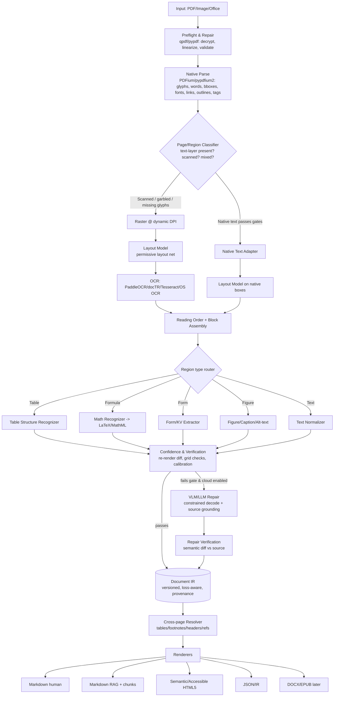

# Philon: Technical Product & Architecture Specification (Draft DESIGN.md / RFC)

> **Erratum, 2026-08-23 — the licensing premise below has expired.**
>
> This RFC is left as written, because it is the record of what was decided and
> why. But one of its load-bearing facts is no longer true, and every conclusion
> that rests on it should be read with that in mind.
>
> Marker was GPL-3.0 when this was written. It is not now: it relicensed
> GPL-3.0 → OpenRAIL → **Apache-2.0** (`65f73c9`, 2026-07-17) and released
> 2.0.0 on 2026-07-20. The 2.0 `LICENSE` is the Apache License 2.0 with no GPL
> text in it, and `pyproject.toml` declares `license = { text = "Apache-2.0" }`.
> Apache-2.0 is compatible with an MIT project subject to attribution and
> NOTICE, so §8.6's "do not fork Marker (GPL)" and §9.3's listing of Marker code
> under *do not use* no longer follow from the licence.
>
> Philon's rule is unchanged — it reuses no Marker code — but it is now held on
> clean-room and dependency-budget grounds rather than legal ones. See the
> README. The Surya weight-licence caveats in this document are separate claims
> and were **not** re-checked here.

## TL;DR
- **Build Philon as a deterministic, native-text-first, IR-centric document converter** that treats OCR and VLM/LLM repair as *selectively invoked, verified* subroutines — not as the default path. The single biggest accuracy-and-speed win over Marker is a routing layer that classifies each page/region and uses expensive models only where explicit quality gates fail.
- **Adopt a permissive stack (PDFium via pypdfium2 [BSD], PaddleOCR/docTR/Tesseract [Apache-2.0], custom/permissive layout models) to escape Marker's GPL code + revenue-capped model-weight licensing.** Marker's code is GPL-3.0 and Surya weights are commercially usable only by organizations with less than $5M gross revenue and less than $5M lifetime VC/angel funding — above that a paid Datalab commercial license is required. Philon must therefore re-implement the pipeline and avoid Surya weights to stay permissive/commercial-friendly.
- **Ship a versioned, loss-aware Document IR first**, with a deterministic Markdown + semantic HTML renderer in v1, JSON/IR and RAG chunks in v1.5, and DOCX/EPUB in v2. Every emitted block carries a source map (page, bbox, extraction method, confidence) enabling audit, visual diffing, and regression testing.

---

## Key Findings
1. **Marker's architecture is a strong reference but licensing-encumbered.** Its Provider→Builder→Processor→Renderer pipeline is sound and worth emulating in shape, but the GPL-3.0 code and Surya's revenue/funding-capped weight license block a clean permissive/commercial product. Philon should reuse *ideas*, not code or weights.
2. **The field has bifurcated into (a) pipeline/deterministic systems (Docling, MinerU pipeline, Unstructured, Marker) and (b) end-to-end VLM systems (olmOCR, Nougat, SmolDocling, Mistral OCR, MinerU-VLM).** Neither category dominates; VLMs improve messy layouts but introduce hallucination and cost/latency. Philon's thesis — deterministic-first with verified selective VLM — is the correct middle path.
3. **A rigorous, versioned Document IR with provenance is the missing primitive** in most open tools (Docling's DoclingDocument is the closest). It is Philon's core differentiator and the foundation for benchmarking, accessibility, and multi-format export.
4. **Confidence must be engineered from concrete signals** (font/glyph mapping integrity, text-image alignment via re-render diff, layout model margins, table grid consistency) — not from a single model's softmax. This is where Philon can measurably beat competitors on reliability.
5. **Benchmarking must resist gaming** via held-out corpora, per-document-class reporting, source-map correctness, and hallucination/regression metrics, using established scorers (TEDS for tables, CDM for formulas, normalized edit distance/CER/WER for text) on OmniDocBench-style corpora plus a Philon-specific held-out set.

---

## Details

# 1. Executive Recommendation

**Thesis.** Philon is a *local-first, provenance-first* document conversion engine whose central abstraction is a **versioned, loss-aware Document IR**. It extracts native PDF structure first, verifies it with cheap deterministic signals, and escalates to high-res rendering, specialized recognizers (tables/math/forms), and finally VLM/LLM repair **only for regions that fail explicit quality gates**. It renders deterministically to Markdown and semantic HTML from the IR, with DOCX/EPUB/RAG-chunk exporters added later.

**Target users.**
- RAG/AI engineers needing clean, chunkable, source-mapped Markdown/JSON at scale and low cost.
- Accessibility/publishing/legal/scientific teams needing faithful, auditable HTML/DOCX with provenance.
- Privacy-sensitive orgs needing a fully local deterministic mode (no cloud calls) with an *optional* pluggable cloud/hybrid mode.

**Positioning.** "The most accurate practical PDF→Markdown converter that never guesses silently." Differentiators vs. Marker: permissive licensing, region-level routing (faster in common cases), engineered confidence + source maps, deterministic reproducibility, and first-class semantic/accessible HTML.

**Non-negotiable principles.**
1. **Deterministic, source-grounded by default.** AI is opt-in and always verified against the source raster/text.
2. **No silent guessing.** Every low-confidence region is marked, and original extraction is retained as an alternative in the IR.
3. **Provenance everywhere.** Every character/block maps back to page + coordinates + method + confidence.
4. **Permissive/commercial-clean licensing.** No GPL/AGPL runtime dependencies in the core; no non-commercial/revenue-capped model weights.
5. **Reproducibility.** Pinned models, deterministic seeds, cache keys; same input → same output.
6. **Progressive & cancelable.** Stream output, cancel, resume, cache.

---

# 2. Marker Audit
*(Reference: the public `VikParuchuri/marker` GitHub repository. The user's local checkout at `/Users/tsevis/AI/marker` could not be directly audited, so all statements below are based on the public repo, README, and Datalab materials, and should be re-verified against the local checkout's pinned version.)*

## 2.1 What Marker does today (inventory)
- **Inputs:** PDF primarily; recent versions also convert images and office/e-book formats (DOCX, PPTX, XLSX, EPUB, HTML) through format-specific providers/converters.
- **Outputs:** Markdown (default), JSON (block tree), HTML, and chunked output. Images are extracted and saved alongside.
- **Surfaces:** CLI (`marker`, `marker_single`), a Python API (`PdfConverter`/`marker.converters`), a simple server, and a Streamlit-based GUI (`marker_gui`).
- **Pipeline components:**
  - **Providers** read the source; the PDF provider uses **pdftext** (Datalab's PDFium-based extractor via pypdfium2) to pull native text, words, and bounding boxes.
  - **Builders** construct the document: a **LayoutBuilder** (Surya layout model), a **LineBuilder/OcrBuilder** (Surya text detection + recognition when native text is absent/poor), and a **StructureBuilder**.
  - **Processors** run in an ordered list operating on the block tree (e.g., table, equation, footnote, section-header, code, blockquote, TOC, reference/link, and optional LLM processors).
  - **Renderers** serialize the block tree to Markdown/JSON/HTML.
- **Models/runtime:** Uses **Surya** (layout detection, text line detection, text recognition/OCR, reading-order, table recognition) built on **PyTorch**; supports CUDA GPU, CPU, and Apple **MPS** via a `TORCH_DEVICE` setting. Per the Surya README, OCR supports 90+ languages while the layout/reading-order/table models are language-agnostic. Native PDF text is preferred when present; pages are rasterized for layout/OCR.
- **Optional LLM mode:** `--use_llm` invokes a hosted VLM (Gemini by default; also configurable to Claude/OpenAI/Ollama/Vertex) to improve tables, equations, forms, inline math, and complex/handwritten regions.
- **Benchmarks:** Marker's README publishes speed and quality benchmarks (a heuristic + LLM-as-judge scoring approach) claiming favorable accuracy/speed vs. tools like Nougat and cloud services; these are author-run and should be treated as vendor benchmarks.

## 2.2 Strengths / Constraints / Upgrade opportunities

| Dimension | Marker today (strength) | Constraint / risk | Philon upgrade opportunity |
|---|---|---|---|
| Pipeline design | Clean Provider→Builder→Processor→Renderer separation | Processor ordering is largely fixed; limited per-region routing | Adaptive per-page/per-block router with quality gates |
| Native text | Uses pdftext/PDFium for fast native extraction | Whole-page decisions; less granular fallback | Region-level native-vs-OCR decisions |
| Layout/OCR | Surya is strong, multilingual (90+ langs OCR) | Surya weights revenue/funding-capped; GPU/VRAM heavy | Permissive layout/OCR stack; smaller routed models |
| Tables/math | Dedicated processors + Surya table rec; LLM assist | LLM assist can hallucinate; cost/latency | Verified table/formula recognizers + constrained repair |
| Licensing | Open source | **GPL-3.0 code; revenue/funding-capped model weights** | Permissive/commercial-clean reimplementation |
| Confidence/provenance | Block tree with positions | No engineered, calibrated confidence or full source map | Loss-aware IR + calibrated multi-signal confidence |
| Output fidelity | Markdown/JSON/HTML | HTML not strongly semantic/accessible; no DOCX/EPUB core | Semantic/accessible HTML5 + DOCX/EPUB exporters |
| Reliability | Works well on clean PDFs | Failure modes on scans/complex layouts; VRAM pressure; some cross-page issues | Cross-page reasoning, resumability, graceful degradation |

## 2.3 Licensing decomposition (what Philon can/can't reuse)
- **Marker code — GPL-3.0.** Per marker's repository LICENSE (github.com/VikParuchuri/marker), the code is GPL-3.0, with a commercial-use waiver of the bundled models for organizations under a $5M revenue/funding threshold. Cannot be copied into a permissive/commercial codebase without imposing GPL. **Reuse ideas/architecture only; do not vendor code.**
- **Surya models/weights — revenue/funding-capped license.** Per Datalab's Surya LICENSE (github.com/VikParuchuri/surya), weights are usable commercially only by organizations with **less than $5M in gross revenue in the most recent 12-month period** and **less than $5M lifetime VC/angel funding**; above either threshold a paid commercial license from Datalab is required. **Do not depend on Surya weights** for a permissive/commercial Philon.
- **pdftext — Datalab library (PDFium-based).** Verify its license before depending on it; if not permissive, replace with a thin pypdfium2-based extractor (PDFium is BSD).
- **Independently implement/replace:** the entire runtime (extraction, layout, OCR, table/math recognizers) using permissive libraries and permissively/self-trained models. Architecture patterns are not copyrightable; the ordered-processor concept can be re-expressed cleanly.

---

# 3. Competitive & Technical Landscape

> **Epistemic note:** The enriched facts below carry named primary sources and dates; remaining items marked *(verify)* are from training knowledge (largely 2024–early 2025) and require re-checking against project LICENSE files, README, papers, model cards, and vendor pricing pages. I separate *verified* facts from *inference*.

## 3.1 Systems (layout/structure/reading order)

| System | Owner | License | Approach | Outputs | Notes |
|---|---|---|---|---|---|
| Marker | Datalab | GPL-3.0 code / revenue-capped weights | Pipeline + Surya + optional VLM | MD/JSON/HTML | Fast on clean PDFs; capped weights |
| Docling | IBM (LF AI & Data) | MIT | Pipeline: layout model + TableFormer; DoclingDocument IR | MD/HTML/JSON/DoclingDocument | Per IBM Research technical report (arXiv:2408.09869, Aug 2024); contributed to LF AI & Data as an incubation project (2025). Strong IR; SmolDocling VLM variant |
| MinerU / MinerU2 | OpenDataLab | AGPL-3.0 *(verify)* | Pipeline (PDF-Extract-Kit) + VLM mode | MD/JSON | AGPL is copyleft; strong on academic |
| Unstructured | Unstructured-IO | Apache-2.0 (lib) *(verify)* | fast/hi_res/ocr_only strategies | Elements JSON | Broad format support; hi_res uses detection model + Tesseract |
| olmOCR | Allen AI (AI2) | Apache-2.0 *(verify)* | End-to-end VLM — a fine-tune of Qwen2-VL-7B-Instruct — + document anchoring | MD/text | Per allenai.org/blog/olmocr (Feb 25, 2025), AI2 reports "about $190 to convert a million PDF pages"; needs GPU |
| Nougat | Meta | code MIT / weights NC *(verify)* | Swin Transformer encoder + mBART-based decoder; 350M-param base model | MMD/MD | Per Blecher et al. (arXiv:2308.13418, 2023). Academic PDFs; repetition/hallucination |
| SmolDocling | IBM/HF | Apache-2.0 *(verify)* | 256M-param VLM on SmolVLM-256M backbone → "DocTags" markup | DocTags→DoclingDocument | Per arXiv:2503.11576 (Mar 2025). Tiny VLM, compact output tags |

## 3.2 Managed APIs

| API | Owner | Model | Pricing | Notes |
|---|---|---|---|---|
| Mistral OCR | Mistral | mistral-ocr-2503 | Per launch announcement (mistral.ai/news/mistral-ocr, Mar 6, 2025): **"1000 pages / $1 (and approximately double the pages per dollar with batch inference)"** | API-only; multilingual, math/tables |
| LlamaParse | LlamaIndex | VLM/LLM tiers | Free daily quota + credits *(verify)* | API; fast/accurate/premium modes |
| Mathpix | Mathpix | Math-specialized OCR | Per-request tiers *(verify)* | LaTeX/MathML/MMD; STEM focus |

## 3.3 Native PDF libraries (licensing is decisive)

| Library | License | Role | Verdict for Philon |
|---|---|---|---|
| **PDFium** (pypdfium2) | **BSD-3** | Glyphs, words, bboxes, render | **Primary engine** |
| MuPDF / PyMuPDF | **AGPL-3.0 / commercial** | Fast parse+render | **Avoid in core** (copyleft) |
| Poppler | **GPL-2/3** | Parse/render | **Avoid in core** |
| pdfminer.six | MIT | Text + layout analysis | Optional permissive helper |
| pdfplumber | MIT | Tables/words (on pdfminer) | Optional |
| pypdf | BSD | Metadata, outlines, split/merge | Utility use |
| qpdf | Apache-2.0 | Repair/linearize/decrypt | Preflight/repair utility |

## 3.4 OCR engines

| Engine | License | Strengths | Notes |
|---|---|---|---|
| PaddleOCR (PP-OCRv4/v5, PP-Structure) | Apache-2.0 *(verify)* | Multilingual, tables/structure | Strong permissive default |
| Tesseract (LSTM) | Apache-2.0 | Ubiquitous, 100+ langs | Weak on complex layout |
| docTR | Apache-2.0 | Modular detect+recognize | TF/PyTorch |
| EasyOCR | Apache-2.0 *(verify)* | Easy multilingual | Heavier, less tunable |
| Surya OCR | revenue/funding-capped | High quality, 90+ langs | **License blocks commercial use above $5M thresholds** |
| Apple Vision / Windows OCR | OS-provided | On-device, free, fast | Platform-locked; good local fallback |

## 3.5 Benchmarks & scorers (verified-in-training)
- **OmniDocBench** (OpenDataLab): diverse real-world PDF pages across document types/languages with rich annotations; reports normalized edit distance for text, **TEDS** for tables, **CDM** for formulas.
- **TEDS** (Tree-Edit-Distance-based Similarity): table-structure metric originating from the PubTabNet/table-recognition literature.
- **CDM** (Character Detection Matching): formula-recognition metric more robust than raw LaTeX string match.
- **CER/WER**: standard text-fidelity metrics for OCR.

**Inference (not a hard fact):** No open tool currently combines (a) region-level routing, (b) engineered/calibrated confidence, and (c) full source-map provenance. This gap is Philon's opening.

---

# 4. Proposed Philon Architecture

## 4.1 Component & data-flow diagram



## 4.2 Stage-by-stage routing logic
1. **Preflight/repair.** Validate/decrypt/linearize with qpdf (Apache) and pypdf (BSD). Detect encryption, damaged xref, incremental updates.
2. **Native parse.** PDFium extracts glyph runs, words, bboxes, font descriptors, links, outlines, and tagged-PDF structure (StructTree) where present. Tagged PDFs are a fast path to headings/lists/tables/reading order.
3. **Page/region classification.** Decide per page: born-digital-clean, born-digital-garbled, scanned, or hybrid. Signals in §6 (Quality Gates).
4. **Native-text-first.** If native text passes gates, use it (fast, exact). Rasterize only failing regions.
5. **Layout + reading order.** Run a permissive layout model; reconcile with native boxes; compute reading order (column detection + XY-cut fallback + learned order).
6. **Region routing.** Send tables/formulas/forms/figures/text to specialized recognizers.
7. **Confidence & verification.** Deterministic checks (re-render diff, grid consistency, dictionary/language-model perplexity). Passing regions land in IR; failing regions escalate.
8. **Optional VLM/LLM repair (cloud/hybrid mode only).** Block-level, constrained decoding, source-grounded, then semantic-diff verified. Never blind whole-page regeneration. Original extraction retained as an alternative.
9. **Cross-page resolution.** Merge cross-page tables, resolve footnotes/endnotes, strip repeated headers/footers, link citations/references.
10. **Render** deterministically from IR.

## 4.3 Document IR (versioned, loss-aware) — schema examples

```json
{
  "philon_ir_version": "1.0.0",
  "document": {
    "id": "sha256:...",
    "source": {"filename": "paper.pdf", "bytes_sha256": "...", "page_count": 12},
    "metadata": {"title": "...", "authors": ["..."], "lang_primary": "en", "langs": ["en","de"]},
    "pipeline": {"philon_version": "1.0.0", "models": {"layout": "philon-layout-v1@sha", "ocr": "paddle-v5@sha"}, "seed": 0},
    "pages": ["page_id..."],
    "audit_trail": [{"stage": "native_parse", "ts": "...", "notes": "text-layer present"}]
  },
  "pages": [{
    "id": "p1", "index": 0, "width_pt": 612, "height_pt": 792, "rotation": 0,
    "render": {"dpi_used": 0, "rasterized": false},
    "blocks": ["b1","b2"]
  }],
  "blocks": [{
    "id": "b1", "page": "p1", "type": "heading", "level": 1,
    "bbox": [72,80,540,110], "reading_order": 0,
    "spans": ["s1"],
    "source": {"method": "native", "confidence": 0.99, "font": "Times-Bold", "size": 18},
    "alternatives": [],
    "transformations": [{"op": "dehyphenate", "by": "text_normalizer"}]
  },{
    "id": "b2", "page": "p1", "type": "table",
    "bbox": [72,150,540,400], "reading_order": 3,
    "table": {"rows": 4, "cols": 3, "cells": [
       {"r":0,"c":0,"rowspan":1,"colspan":1,"text":"Year","bbox":[...],"confidence":0.97,"is_header":true}
    ], "spanning_across_pages": false},
    "source": {"method": "table_recognizer", "confidence": 0.91},
    "alternatives": [{"method":"native_grid","confidence":0.7,"cells":[...]}],
    "verification": {"grid_consistent": true, "re_render_iou": 0.94}
  }],
  "spans": [{
    "id": "s1", "text": "Introduction",
    "char_sources": [{"char_range":[0,12],"page":"p1","bbox":[72,82,180,104],"method":"native","confidence":0.99}],
    "style": {"bold": true},
    "links": []
  }],
  "formulas": [{"id":"f1","block":"b3","latex":"E=mc^2","mathml":"<math>...</math>",
     "source":{"method":"math_recognizer","confidence":0.88},"cdm_selfcheck":0.9}],
  "figures": [{"id":"fig1","block":"b4","asset":"assets/fig1.png","caption_block":"b5",
     "alt_text":"...","source":{"method":"native_image","confidence":1.0}}],
  "citations": [{"id":"c1","span":"s9","target_ref":"r3","type":"inline"}],
  "references": [{"id":"r3","raw":"Smith 2020...","structured":{"authors":["Smith"],"year":2020}}]
}
```

**Design properties:** additive, semver-versioned; loss-aware (retains `alternatives`, `transformations`, and raw text); deterministic rendering; extensible to DOCX/EPUB. Source maps at the character level (`char_sources`) enable visual diffing and full audit.

---

# 5. Output Strategy — Fidelity Matrix

| Format | Priority | Fidelity guarantees | Irreducible limitations |
|---|---|---|---|
| **Markdown (human)** | v1 | Headings, lists, links, images, GFM tables, code, blockquotes, inline math ($...$), footnotes | Complex nested tables, multi-column, precise positioning, spanning cells lossy in MD |
| **Markdown (RAG) + chunks** | v1.5 | Stable chunk boundaries, heading-path metadata, per-chunk source map, token-aware splits | Table/figure semantics compressed for retrieval |
| **Semantic/Accessible HTML5** | v1 | `<h1-6>`, `<table>` with `<thead>/scope`, `<figure>/<figcaption>`, ARIA roles, `lang`, MathML, `data-philon-*` source-map attrs, embedded/linked assets | Pixel-perfect visual reproduction not a goal |
| **JSON / Document IR** | v1 | Lossless representation, full provenance, alternatives, confidence | Consumer must understand schema |
| **Plain text** | v1 | Reading-order text | No structure |
| **DOCX** | v2 | Headings/lists/tables/images/footnotes/styles | Math via OMML mapping imperfect; complex layout simplified |
| **EPUB** | v2 | Reflowable chapters from headings, nav, images, MathML | Fixed-layout books simplified |
| **TEI/JATS** | v3 (justified for scholarly) | Structured articles/references | High annotation cost; only for scholarly pipelines |
| **ALTO/hOCR** | v3 (justified for OCR/library) | Word-level coordinates + confidence | Only where downstream (library/archival) needs it |

**Justification for niche formats:** TEI/JATS only for scientific/humanities publishing customers; ALTO/hOCR only for library/archival OCR workflows. Do not build these in v1.

---

# 6. Accuracy & Speed Strategy (specific, with trade-offs)

**Priority 1 — Native-text-first with region-level fallback.** Born-digital PDFs (the majority in most corpora) need *no* OCR. Extract native glyphs/words/bboxes via PDFium and OCR only regions that fail gates. *Trade-off:* requires robust garbled-text detection to avoid trusting corrupt text layers. *Accuracy:* higher (native is exact); *latency/compute:* far lower (skip raster+OCR); *cost:* near-zero for clean PDFs; *privacy:* fully local; *licensing:* PDFium BSD.

**Priority 2 — Dynamic DPI.** Rasterize failing regions at DPI chosen by font size / stroke width, not a global high DPI. *Trade-off:* small classifier cost; big memory/latency savings vs. blanket 300+ DPI.

**Priority 3 — Work deduplication & caching.** Content-addressed cache keyed on `(page_bytes_hash, model_versions, params)`. Skip re-processing identical pages (common in headers/footers, forms). *Trade-off:* cache storage; large repeat-run savings; enables resumability.

**Priority 4 — Batching & parallelism.** Batch layout/OCR/table inference across pages; multi-GPU sharding by page; CPU/MPS graceful degradation with smaller models. *Trade-off:* batching adds latency for single-doc interactive use; expose a low-latency mode.

**Priority 5 — Verified selective VLM repair (optional).** Use VLM only on gate-failing blocks, with constrained decoding to the IR schema and mandatory semantic-diff verification against source text/raster; reject repairs that add unsupported tokens. *Trade-off:* cloud cost/latency/privacy; only in hybrid mode; always keep original as alternative. **Critical stance:** adding an LLM does *not* inherently increase accuracy — unverified LLM output frequently *reduces* fidelity via hallucination; Philon treats VLM output as a *hypothesis to be verified*, never as ground truth.

**Priority 6 — Cross-page structure at document level.** Resolve spanning tables, footnotes, and repeated headers/footers after per-page assembly, using geometric + textual continuity signals.

**Quality gates & confidence signals (concrete, not "use AI confidence"):**
- **Native-text validity:** ratio of glyphs with valid `ToUnicode`/CID→Unicode mapping; count of `.notdef`/replacement (U+FFFD) glyphs; proportion of characters in expected Unicode ranges/dictionary hit rate; detection of custom-encoded/subset fonts producing gibberish; presence of invisible text (render mode 3) or OCR-overlay layers; duplicated-text detection (identical spans at same bbox).
- **Text-to-image alignment:** re-render the extracted text into the page bbox and compute IoU / pixel-diff against the source raster; low overlap flags mis-extraction.
- **Layout/reading-order confidence:** margin between top-1 and top-2 layout-class scores; overlap/gap anomalies between blocks; column-consistency checks.
- **Table confidence:** grid consistency (row/col counts consistent across cells), border-vs-content alignment, TEDS-style self-consistency on a re-parse.
- **Formula confidence:** round-trip render of extracted LaTeX vs source crop (CDM-style self-check).
- **Escalation policy:** native → specialized recognizer → (hybrid only) VLM repair → mark uncertain + retain original. Thresholds calibrated on a labeled dev set (reliability diagrams / temperature scaling), not hard-coded softmax cutoffs.

**Expected trade-off summary:** Philon should be *faster than Marker on clean born-digital PDFs* (skips raster/OCR entirely for passing pages) and *comparable-or-slower on fully scanned docs* (same OCR cost, plus verification), while being *more accurate and more auditable* across the board because it never emits unverified content silently.

---

# 7. Benchmark Blueprint

## 7.1 Corpus composition (stratified, held-out)
Sample by: **document class** (scientific paper, textbook, newspaper/magazine, legal filing, invoice/form, slide deck, book, government report, historical/handwritten); **language/script** (Latin, CJK, Arabic/Hebrew RTL, Indic, mixed); **scan quality** (born-digital, clean scan, degraded scan, photo/skew); **length**; **complexity** (multi-column, spanning tables, dense math); **accessibility** (tagged vs untagged PDF).

## 7.2 Gold data & annotation
- Reuse public sets (**OmniDocBench** and similar) for comparability, plus a **Philon held-out set** never shared with model training and rotated periodically.
- Annotate to the Philon IR: block types, reading order, table cell grid, formula LaTeX/MathML, links, captions, and **source-map ground truth** (bbox per block).
- Dual annotation + adjudication for a labeled subset; measure inter-annotator agreement.

## 7.3 Metrics
- **Text fidelity:** normalized edit distance, **CER/WER**.
- **Reading order:** rank correlation / sequence edit distance vs gold order.
- **Structure:** heading-level accuracy, list nesting accuracy.
- **Tables:** **TEDS** (structure + content), cell/row/col precision/recall, spanning-cell accuracy, cross-page merge correctness.
- **Formulas:** **CDM** and LaTeX-normalized match.
- **Figures/captions/links:** extraction recall, caption-association accuracy, link preservation.
- **HTML:** W3C validity, axe-core accessibility pass rate, MathML validity.
- **Markdown usability:** round-trip stability, chunk-boundary stability.
- **Source-map correctness:** IoU of emitted-block bbox vs gold; char-level provenance accuracy.
- **Hallucination/regression:** unsupported-token rate (tokens not grounded in source), and a regression score vs prior Philon version.
- **Speed/cost:** cold/warm latency, pages/sec, per-device (GPU/CPU/MPS) throughput, peak VRAM/RAM, $/page (for cloud modes), batch throughput, energy where measurable.

## 7.4 Baselines & harness
Compare against **Marker, Docling, MinerU, Unstructured, olmOCR, Mathpix, LlamaParse, Mistral OCR** (separating local/open from managed APIs, and noting each tool's license). Harness: containerized, pinned versions, fixed seeds, per-document-class breakdowns, public leaderboard with methodology. Use published anchors for cost sanity checks (e.g., olmOCR's ~$190/1M pages and Mistral OCR's 1000 pages/$1) but re-measure on identical hardware/corpora rather than trusting vendor numbers.

## 7.5 Anti-gaming controls & CI gates
- **Held-out rotating test set**; never train/tune on it.
- **Report per-class**, not a single aggregate, to prevent optimizing one easy slice.
- **Blind hallucination metric** weighted heavily.
- **CI regression gate:** block merges that drop any per-class metric beyond a threshold or increase hallucination rate; nightly full-suite runs; golden-output and visual-diff tests on a fixed mini-corpus.

---

# 8. Build Plan

## 8.1 Language/runtime & core dependencies
- **Core in Python** (ecosystem fit for models) with **performance-critical paths in Rust** (via PyO3) where profiling justifies (e.g., IR assembly, source-map math). *Trade-off:* Rust adds build complexity; adopt only after profiling.
- **PDF parse/render:** pypdfium2 (**PDFium, BSD**); pdfminer.six/pdfplumber (MIT) as optional helpers; qpdf (Apache) + pypdf (BSD) for preflight/repair. **Avoid PyMuPDF (AGPL) and Poppler (GPL) in core.**
- **OCR:** PaddleOCR (Apache) default; docTR/Tesseract (Apache) alternates; Apple Vision/Windows OCR as on-device fallbacks. **Do not use Surya weights** (revenue/funding-capped license).
- **Layout/table/math models:** train or fine-tune permissively-licensed models, or use permissively-licensed open models; publish weights under a permissive license.
- **VLM/LLM (optional hybrid):** pluggable providers (Gemini/Claude/OpenAI/local Ollama/vLLM) behind an interface with constrained decoding + verification.

## 8.2 Module/file layout (proposed `ai/claudecode/philon`)
```
philon/
  ir/            # schema, versioning, validation, serde
  providers/     # pdf(pdfium), image, docx, pptx, epub, html
  preflight/     # qpdf/pypdf repair, encryption, validation
  classify/      # page/region condition classifiers + quality gates
  layout/        # layout models, reading order
  ocr/           # engines behind a common interface
  recognizers/   # table, formula, form, figure
  verify/        # re-render diff, grid checks, calibration, semantic diff
  repair/        # optional VLM/LLM providers + constrained decode
  resolve/       # cross-page tables/footnotes/headers/refs
  render/        # markdown, html, json, chunks, (docx, epub)
  cache/         # content-addressed store, resumability
  runtime/       # job model, scheduling, batching, GPU/MPS/CPU
  api/           # cli, python api, rest service
  bench/         # corpus, metrics, harness, CI gates
  plugins/       # entry-point based extension registry
```

## 8.3 Plugin interfaces
Stable, versioned interfaces (Python `Protocol` + entry points) for: **Provider**, **Classifier/QualityGate**, **LayoutEngine**, **OCREngine**, **Recognizer** (table/math/form/figure), **RepairModel**, **Renderer**, **CacheBackend**, **StorageBackend**. Each declares capabilities, device support, and license metadata.

## 8.4 CLI / API / service / job model / observability
- **CLI:** `philon convert in.pdf --to md,html,json --mode local|hybrid --profile fast|accurate`.
- **Python API:** `Philon().convert(path, outputs=[...], mode=...) -> IR`.
- **REST:** async job submit/status/stream/cancel; progressive output; resumable.
- **Observability:** structured logs, per-stage timing/VRAM metrics, OpenTelemetry traces, per-document audit trail persisted in IR.
- **Reproducibility:** pinned model hashes, seeds, param snapshot in IR `pipeline` block.
- **Security/privacy:** local-only default (no network); explicit opt-in for cloud; redaction hooks; no telemetry by default; signed model downloads with hash verification.

## 8.5 Testing plan
Unit (IR, gates, renderers), integration (end-to-end per doc class), **golden-output** (fixed corpus, exact/near-exact), **visual-diff** (render IR back over raster, check IoU), **fuzzing** (malformed/adversarial PDFs, huge/zero-byte, deep nesting, decompression bombs), **adversarial** (invisible text layers, OCR-overlay traps, duplicated glyphs), **performance** (latency/throughput/VRAM regression).

## 8.6 Migration strategy from Marker
Do **not** fork Marker (GPL). Re-implement the Provider→Builder→Processor→Renderer *shape* cleanly; port *concepts* (ordered processors, block tree) into Philon's IR-centric design; build a compatibility test comparing Philon vs Marker outputs on a shared corpus to guide parity, without inheriting GPL coupling or Surya weights.

## 8.7 30/60/90-day plan, risks, go/no-go
- **Days 0–30 (Foundations):** IR schema v0.1 + validator; PDFium provider; native-text gates; Markdown + HTML renderer; golden-test harness. **Go/no-go:** clean born-digital PDFs → faithful MD/HTML with source maps; determinism verified.
- **Days 31–60 (Recognition + routing):** permissive layout model integration; PaddleOCR fallback; table + formula recognizers; confidence/verification; caching/resumability; first benchmark run vs Marker/Docling on 3 doc classes. **Go/no-go:** match-or-beat Marker on tables/text for those classes; faster on clean PDFs.
- **Days 61–90 (Scale + optional repair):** multi-GPU batching; cross-page resolution; RAG chunk output; optional verified VLM repair (hybrid); public benchmark + CI gates; DOCX/EPUB exporter spike. **Go/no-go:** per-class metrics + hallucination gate green; reproducible public leaderboard.
- **Key risks:** (1) permissive layout/OCR quality vs Surya — mitigate by fine-tuning + verification; (2) garbled-native-text detection false-negatives — mitigate with calibrated multi-signal gates; (3) VLM hallucination — mitigate via verification + alternatives; (4) scope creep on niche formats — defer TEI/JATS/ALTO.
- **Skills/owners:** ML eng (layout/OCR/table/math), systems eng (runtime/GPU/caching), PDF/format specialist, eval/benchmark eng, product owner.

---

# 9. Final Decision Log

## 9.1 Recommended technologies (ranked)
1. **PDFium via pypdfium2** (BSD) — native parse/render core.
2. **Custom versioned Document IR** — the product's spine.
3. **PaddleOCR** (Apache) — default OCR; **docTR/Tesseract** alternates; **Apple Vision/Windows OCR** on-device fallback.
4. **Permissively-licensed / self-trained layout, table, and formula models**.
5. **qpdf + pypdf** — preflight/repair.
6. **Deterministic renderers** (Markdown/HTML/JSON) before any VLM.
7. **Pluggable VLM providers** (hybrid mode only) with constrained decoding + verification.
8. **OmniDocBench + TEDS + CDM + CER/WER** — evaluation.

## 9.2 Do not use / do not depend on
- **Marker code** (GPL-3.0) — copyleft; would force GPL on Philon.
- **Surya weights** (revenue/funding-capped, $5M thresholds) — blocks commercial use at scale.
- **PyMuPDF/MuPDF** (AGPL) and **Poppler** (GPL) in the core — copyleft.
- **Blind whole-page VLM/LLM regeneration** — hallucination risk; unverifiable.
- **Single-model softmax "confidence"** as the routing signal — not calibrated/grounded.
- **MinerU code** as a dependency if permissive licensing matters (AGPL-3.0, verify).

## 9.3 Open questions requiring a product decision
1. **Permissive vs commercial licensing target** — do we need to serve customers above the $5M revenue/funding thresholds day one (rules out any capped weights, mandates fully permissive models)?
2. **Local-only vs hybrid default** — which is the flagship mode for positioning?
3. **Own-trained models vs integrate open models** — build cost vs licensing certainty.
4. **How much accessibility (WCAG) to guarantee** in HTML v1 vs later.
5. **Which document classes are v1 priority** (RAG-clean PDFs vs scanned archives vs scholarly)?
6. **Rust adoption threshold** — when does performance justify the build complexity?

---

## Recommendations (staged)
1. **Now:** Ratify the non-negotiables (§1) and lock the licensing target (§9.3-1). Stand up IR v0.1 + PDFium provider + native-text gates + deterministic MD/HTML renderers + golden tests (Days 0–30). *Benchmark that changes plan:* if permissive layout/OCR can't reach Marker parity on target classes by Day 60, reconsider a commercial Surya license as a stopgap while training replacements.
2. **Next:** Add routing, recognizers, verification, caching; run first head-to-head vs Marker/Docling on 3 doc classes (Days 31–60). *Threshold:* proceed only if faster on clean PDFs AND ≥ Marker table/text quality on those classes.
3. **Then:** Scale (multi-GPU/batching), cross-page resolution, RAG chunks, optional verified VLM repair, public benchmark + CI gates (Days 61–90). *Gate:* hallucination metric and per-class regression gates green before any public release.
4. **Defer:** DOCX/EPUB to v2; TEI/JATS/ALTO/hOCR to v3 and only for specific customers.

## Caveats
- **Verification gap (important):** Live primary-source web browsing could not be completed in this run (research tooling was exhausted before browsing). The enrichment pass supplied named-source confirmations for the highest-stakes claims — **Marker GPL-3.0 and the $5M revenue/funding threshold; Surya weights' $5M revenue and $5M lifetime funding caps; Mistral OCR pricing (1000 pages/$1, mistral-ocr-2503, Mar 6, 2025); olmOCR as a Qwen2-VL-7B fine-tune with ~$190/1M pages (Feb 25, 2025); Docling MIT + arXiv:2408.09869 + LF AI & Data; SmolDocling 256M/DocTags (arXiv:2503.11576); Nougat Swin+mBART 350M (arXiv:2308.13418); Surya OCR 90+ languages.** All remaining items marked *(verify)* — MinerU AGPL, Unstructured/PaddleOCR/EasyOCR/olmOCR license identifiers, LlamaParse and Mathpix pricing, pdftext's license — are from training knowledge and **must be re-checked against project LICENSE files, README, papers, model cards, and vendor pricing pages** before this becomes an authoritative RFC.
- **Marker local checkout not audited:** All Marker statements are from the public repo, not `/Users/tsevis/AI/marker`; confirm the pinned version and any local patches.
- **Vendor benchmarks are not neutral:** Marker's, Mistral's, AI2's and others' self-published numbers should not be taken as independent ground truth; re-measure on identical hardware/corpora.
- **LLM caution:** Do not assume VLM/LLM involvement improves accuracy; without verification it frequently degrades fidelity. Philon's design deliberately constrains and verifies it.
- **Model licensing is the top schedule risk:** achieving Marker-level quality with fully permissive weights may require training investment; budget for it.